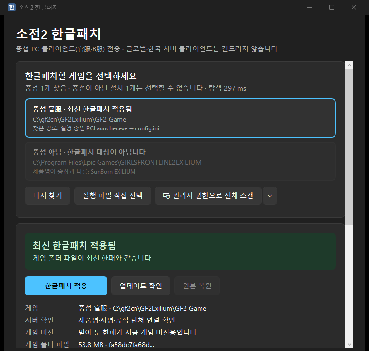

# 소전2 한글패치 (SnqxKR)

소녀전선2: 망명 **중섭** 클라이언트(안드로이드·PC)에 커뮤니티 한글패치(`LangPackageTableCnData.bytes`)를
자동으로 받아 넣고, 게임 업데이트로 한패가 맞지 않게 되면 새 한패가 나올 때까지 쓸 **임시 복구본**을 직접 만들어 넣는 앱.
[arca.live 가이드](https://arca.live/b/gilrsfrontline2exili/127344286)의 수동 절차(Shizuku + X-plore 로 직접 복사)를 앱 하나로 대체한다.

번역은 만들지 않는다. 번역은 커뮤니티 한패 저장소 [nemasdf/haguel-baefo](https://github.com/nemasdf/haguel-baefo) 의 것을 그대로 쓴다.

| | 안드로이드 | 윈도우 |
|---|---|---|
| 대상 | 중섭 官服·B服·QQ 앱 | 중섭 PC 클라이언트 (官服·B服) |
| 요구 사항 | Android 9+, Shizuku v11+ | Windows 10 (1903+)·11, 설치 없이 exe 하나 |
| 배포 파일 | `snqx-krpatch-*.apk` (Kotlin 엔진), `*-native-arm64.apk` (C++ 엔진) | `SnqxKR.exe` (C# 엔진), `SnqxKR-native.exe` (C++ 엔진) |
| 자세한 문서 | 이 문서 | [windows/README.md](windows/README.md) |

글로벌·한국 서버 클라이언트는 어느 판에서도 건드리지 않는다 ([중섭만 건드리는 방법](#중섭만-건드리는-방법)).

## 하는 일

1. **찾기**: 설치된 중섭 클라이언트를 모두 찾는다. 여러 개면 골라서 적용한다.
2. **받기**: 한패 저장소의 최신 `LangPackageTableCnData.bytes` 를 받는다. 바뀐 게 없으면 본문을 받지 않는다 ([중복 다운로드 방지](#중복-다운로드-방지)). 받은 파일이 한패 표로 읽히지 않으면(오류 페이지, 끊긴 파일) 버린다.
3. **적용**: 게임 폴더에 복사하고 SHA-256 으로 다시 확인한다. 설치마다 처음 한 번, 게임 폴더 파일이 공식 원본(한글 없음)이면 백업한다 (다른 한패가 들어 있으면 원본이 아니라 백업하지 않는다).
   - 안드로이드: `/sdcard/Android/data/<패키지>/files/LocalCache/Data/Table/LangPackageTableCnData.bytes` (Shizuku 특권 프로세스로)
   - 윈도우: `<게임 폴더>\GF2_Exilium_Data\LocalCache\Data\Table\LangPackageTableCnData.bytes`
4. **게임 업데이트 대응**: 게임이 업데이트되면 옛 한패를 그대로 넣지 않고, 임시 복구본을 만들어 넣는다. 정식 한패가 올라오면 교체한다 ([아래](#게임-업데이트-대응-임시-복구)).
5. **원본 복원**: 백업이 지금 게임 버전의 원본일 때만 되돌린다 (옛 버전 원본을 넣으면 게임이 깨진다).
6. **저장 공간 관리**: 캐시·번역 메모리·공식 원본 보관본·원본 백업의 크기를 보여 주고 지울 수 있다.

게임이 실행 중이면 쓰지 않는다 (안드로이드는 `/proc` 로, 윈도우는 그 폴더의 `GF2_Exilium.exe` 프로세스로 확인).

## 게임 업데이트 대응 (임시 복구)

게임은 업데이트할 때마다 문장 Id 를 **전부 다시 매긴다.** 옛 한패를 새 버전에 넣으면 문장이 엉뚱한 자리에 나온다.
그래서 이 앱은 한패와 게임의 버전 지문(Id 집합)이 다르면 옛 한패 적용을 막고, 대신 이렇게 한다.

1. **공식 원문 보관**: 게임 폴더의 파일이 공식본(한글 없음)일 때마다 앱 데이터에 보관한다.
2. **번역 메모리**: 같은 버전의 공식 원문과 한패를 같은 Id 끼리 짝지어 `중국어 원문 → 한국어` 를 모은다. 버전이 바뀌어도 누적한다 (최대 500MB, 넘으면 오래전에 본 줄부터 뺀다).
3. **임시 복구 1단계**: 새 공식 원문의 모든 문장을 번역 메모리에서 원문으로 찾아 한국어로 바꾼다. 없는 문장(새 콘텐츠)은 중국어로 둔다.
4. **임시 복구 2단계**: 업데이트 전에 쓰던 한패가 번역 메모리보다 새것이면, 그 번역을 새 Id 자리로 옮긴다 (같은 문장이 3줄 이상 이어지는 곳을 기준점으로, 태그·숫자 모양이 다르면 버린다).
5. **정식 한패 복귀**: 새 버전용 한패가 올라오면 임시 복구본을 정식 한패로 바꾼다.
6. **자리 검사**: 업데이트 직후 올라온 한패가 원문과 자리가 어긋나 있으면(번역 안 된 줄이 같은 Id 원문과 90% 미만 일치) 번역 메모리에 넣지 않고 적용을 막는다. 사용자가 "그래도 이 한패 적용 (받은 시각 · 원문과 자리 일치율)" 로 넣을 수 있다.

화면의 큰 버튼은 늘 지금 할 일 하나를 보여 준다 (윈도우·안드로이드 같은 규칙). 게임이 업데이트됐는데 서버에 새 한패가 이미 있으면 "새 한패 받아서 적용" 이 나오고, 받아서 이 게임 버전용이면 바로 넣고 아직 아니면 임시 복구한다. 새 한패가 없으면 "임시 복구", 임시 복구본으로 기다리는 중이면 "새 한패 확인", 맞는 한패가 오면 "정식 한패로 교체".

실측 (GitHub 이력 6개 게임 버전과 공식 원문 2개, 자세한 표는 [docs/lang-table-format.md](docs/lang-table-format.md)):

| 상황 | 결과 |
|---|---|
| 같은 버전 원문 + 한패로 만든 번역 메모리로 복구 | 한패와 다른 번역 0줄 |
| 번역 메모리가 세 버전 전(V4)인데 게임이 V1 이 됨 | 중국어 문장의 **93.8%** 가 한국어로, 그중 96% 가 실제 V1 한패와 같은 번역 |
| 위에 업데이트 전 한패(V2)의 번역 옮기기를 더함 | 5,114줄을 더 옮김, 그중 99.2% 가 실제 V1 한패와 같음 |
| 중국어로 남는 줄 | 세 번의 업데이트 동안 새로 생긴 문장 약 3만 줄 |

번역 메모리는 이 앱이 한 번은 같은 버전의 공식 원문을 봐야 생긴다. 이 앱으로 처음 적용하면(적용 전 원본 보관) 자동으로 생기고,
안드로이드 1.0 사용자는 그때 남긴 원본 백업과 GitHub 이력에서 같은 버전 한패를 찾아(색인만 `Range` 로 1MB 안쪽 비교) 준비한다.

## 중섭만 건드리는 방법

실행 파일 이름과 폴더 구조는 글로벌(Steam·에픽 포함)·한국 서버도 같다. 이름으로 가르지 않는다.

- **안드로이드**: 패키지 허용 목록 `com.Sunborn.SnqxExilium` / `.bilibili` / `.qq` 밖은 경로조차 만들지 않는다 (글로벌 `.Glo` 는 이름 앞부분이 같다).
- **윈도우** (`CnServerCheck`): `app.info` 의 회사명·제품명(`SunBorn` / `少女前线2：追放`), 게임 실행 파일의 코드 서명자(`上海散爆信息技术有限公司`),
  그리고 官服 런처(`PCLauncher.exe`) 또는 B服 빌리빌리 런처와의 연결을 모두 확인한다. 하나라도 어긋나면 "중섭 아님"으로 목록에만 보이고 선택할 수 없다.
  (에픽 글로벌판 `Epic Games\GIRLSFRONTLINE2EXILIUM` 이 "제품명이 중섭과 다름: SunBorn EXILIUM" 으로 막히는 것을 확인했다.)
- 관리자 권한으로 파일을 쓰는 도우미도 대상이 중섭으로 확인된 게임 폴더의 `LangPackageTableCnData.bytes` 인지 다시 확인한다.

## 안드로이드

### 요구 사항

- Android 9+ (minSdk 28), Shizuku v11+ 실행 중 (무선 디버깅·adb, root, Sui 모두 가능)
- 안드 13+ 에서는 `Android/data` 직접 접근이 막혀 Shizuku 가 필수다.
  Shizuku 가 root 로 떠 있으면 uid 0, adb 로 떠 있으면 uid 2000(shell) 으로 동작하며 둘 다 이 경로에 쓸 수 있다.
- 권한은 Shizuku-API 공식 흐름대로 요청한다. "다시 묻지 않음"으로 거부했다면 요청 창이 뜨지 않으므로 Shizuku 앱의 앱 관리에서 허용한다.
- 무선 디버깅으로 띄운 Shizuku 는 폰을 다시 켜면 꺼진다. 앱의 준비 카드가 설치 → 실행 → 권한 순서로 안내한다.

### 설치

[Releases](../../releases) 에서 APK 를 받아 설치한다.

```
adb install -r snqx-krpatch-*.apk
```

- `snqx-krpatch-<판>.apk`: Kotlin 엔진. 모든 기기.
- `snqx-krpatch-<판>-native-arm64.apk`: C++ 엔진(`libsnqx.so`, arm64-v8a). `.so` 를 못 올리면 Kotlin 엔진으로 돈다.
- 업데이트 대응·윈도우판은 v2.0 부터 들어 있다. Releases 의 APK 는 v1.0 과 같은 키로 서명돼 있어 지우지 않고 덮어쓰기 설치된다 (기록·백업이 그대로 남는다).
- [Actions](../../actions) 의 `apk` 아티팩트는 빌드마다 새 디버그 키로 서명돼, 설치된 앱 위에 덮어쓸 수 없다 (시험용).

### 백그라운드 확인·알림

배터리와 백그라운드 점유를 줄이는 쪽으로 만들었다.

- **기본 꺼짐.** 꺼져 있으면 예약 작업 자체가 없다. 알림 권한은 기능을 켜는 순간에만 묻는다.
- WorkManager 주기 작업만 쓴다 (6 / **12** / 24시간). 네트워크 연결, 배터리·저장공간 부족 아님일 때만. 상주 서비스·wakelock·정확한 알람 없음.
- 바뀐 게 없으면 한패는 `HEAD`(0바이트), 게임 파일은 크기·수정시각만 본다.
- 볼 클라이언트가 없거나 알림이 모두 꺼져 있으면 Shizuku 를 깨우지 않는다. 모바일 데이터로 받을지는 설정에서 고른다.
- 알림은 세 종류이고 채널이 나뉘어 있다: 한패가 풀림(게임 업데이트) / 정식 한패 나옴(임시 복구 중) / 같은 버전 번역 갱신(조용한 채널, 기본 꺼짐).
- 파일은 백그라운드에서 바꾸지 않는다. 알림만 보낸다.

## 윈도우



자세한 동작·판별 규칙은 [windows/README.md](windows/README.md).

- **설치 없음**: exe 하나. .NET Framework 4.8 (Windows 10 1903+·11 에 기본 포함). `SnqxKR-native.exe` 는 C++ 엔진 DLL 을 안에 넣었고, 64비트가 아니거나 DLL 을 못 올리면(Smart App Control 등) C# 엔진으로 돈다.
- **데이터**: `%LOCALAPPDATA%\SnqxKR\` (설정·한패 캐시·공식 원본 보관·번역 메모리·백업). 0.2 가 exe 옆에 만든 `SnqxKR-data\` 는 새 위치에 설정이 없을 때 처음 한 번 옮긴다.
- **게임 찾기** (디스크를 순회하지 않는다): 실행 중인 게임·런처, 레지스트리 제거 정보, 바탕화면·시작 메뉴 바로가기, 런처 `config.ini`, B服 기본 경로, **Everything 색인**(떠 있으면), 전에 찾은 경로.
  - Everything 은 IPC(`WM_COPYDATA`)로 두 실행 파일 이름만 묻는다 (관리자 권한 없이 수십 ms). 이름이 정확히 같은 것만 남긴다.
- **실행 파일 직접 선택**: `GF2_Exilium.exe` / `PCLauncher.exe` 를 골라 추가한다.
- **관리자 권한으로 전체 스캔**: NTFS 파일 목록(MFT)을 읽어 몇 초 안에 게임·런처를 찾는다. 옆의 작은 ▾ (고급 설정)에서 훑을 루트 드라이브를 체크로 고른다
  (처음에는 고정 NTFS 드라이브 전부, 바꾸면 기억한다). NTFS 가 아닌 드라이브(FAT·exFAT)는 MFT 가 없어 고를 수 없다. 훑지 못한 드라이브는 이유가 기록에 남는다.
- **관리자 권한**: 앱은 일반 권한으로 돈다. 전체 스캔과, `Program Files` 처럼 쓰기 권한이 없는 게임 폴더에 파일을 넣을 때만 같은 exe 를 관리자 권한으로 한 번 더 띄운다 (UAC 창).

## 번역 엔진

같은 엔진이 세 벌 있고, **같은 입력이면 결과가 바이트 단위로 같다** (번역 메모리 파일, 복구본 SHA-256, 줄 수, 오류 여부).

| 엔진 | 쓰는 곳 | 파일을 올리는 방식 |
|---|---|---|
| Kotlin (`app/.../langtable/`) | 안드로이드 kotlin 판, native 판에서 `.so` 를 못 올릴 때 | 메모리 매핑 (힙 한도에 들지 않는다. 옛 한패 포함 복구 한 번에 힙 48MB) |
| C# (`windows/.../Engine/`) | `SnqxKR.exe`, native 판에서 DLL 을 못 올릴 때 | 한 번에 읽기 (윈도우는 매핑한 파일을 게임 업데이터가 못 바꾼다) |
| C++ (`native/`) | 안드로이드 native 판 `libsnqx.so`, 윈도우 `snqx.dll` | 매핑 후 작업이 끝나면 바로 해제, 4스레드 |

- 문장을 줄마다 복사하지 않고 파일 안의 자리(시작·길이)만 든다. 번역 메모리는 원문 64비트 해시의 정렬 배열이고, 해시 상위 16비트 칸 색인으로 찾는다 (HashMap·문자열 키 없음).
- 세 엔진이 갈리지 않도록 이진 탐색·태그 모양 검사(UTF-16 코드 단위)·깨진 UTF-8 처리를 라이브러리에 맡기지 않고 같은 코드로 직접 쓴다.
  깨진 번역 메모리(키 순서가 어긋나거나 겹침), 윈도우 0.2 의 리틀엔디안 메모리, 10바이트를 넘는 varint 도 세 엔진이 같게 처리한다.
- 확인: 실제 데이터(497,166줄)로 36개 연산과 태그 모양 검사 149만 줄이 다섯 조합(PC 의 Kotlin·C#·C++, S25 의 Kotlin·C++) 모두 같다.

속도 (V1 공식 원문 + 같은 버전 한패, 옛 한패 포함 임시 복구 한 번):

| | 시간 |
|---|---|
| PC C# / C++ | 0.53초 / 0.29초 |
| S25 C++ (prime 코어) | 0.59초 |
| S25 Kotlin | 0.8~1.6초 (ART 편차가 크다) |

파일 형식과 알고리즘은 [docs/lang-table-format.md](docs/lang-table-format.md), C++ 판은 [native/README.md](native/README.md).

## 중복 다운로드 방지

| 단계 | 방법 | 절약 |
|---|---|---|
| 1 | `HEAD` 로 ETag 비교 | 본문 0바이트 |
| 2 | `GET` + `If-None-Match` → `304` | 본문 0바이트 |
| 3 | 받은 내용의 SHA-256 이 캐시와 동일 | 파일 교체 생략 |

실측 결과 raw.githubusercontent.com 은 `If-None-Match` 를 무시하고 200 + 전체 본문을 준다(2026-08 기준).
즉 실제로 다운로드를 막는 건 1단계(HEAD ETag 비교)이고, 2·3단계는 폴백이다.
ETag 값은 콘텐츠 해시라 파일이 갱신될 때만 바뀐다.

추가로 적용 직전 **게임 폴더의 파일 해시**와 캐시 해시를 비교해서, 같으면 복사 자체를 건너뛴다.
게임 폴더 파일은 크기·수정시각이 그대로면 해시·본문 읽기를 건너뛴다.

## 빌드

### 안드로이드

JDK 17 이상, Android SDK Platform 37, NDK `30.0.16248370`, CMake `4.1.2` (native 판용. kotlin 판도 CMake 설정 단계는 돈다).

```bash
sdkmanager --install "ndk;30.0.16248370" "cmake;4.1.2"

./gradlew assembleKotlinRelease    # app/build/outputs/apk/kotlin/release/app-kotlin-release.apk (약 2.4MB)
./gradlew assembleNativeRelease    # app/build/outputs/apk/native/release/app-native-release.apk (약 2.8MB, arm64-v8a)
./gradlew assembleKotlinDebug      # 패키지 com.hoho.snqxkr.debug: 배포본과 나란히 설치된다
```

시크릿(`RELEASE_KEYSTORE` = base64 keystore, `RELEASE_KEYSTORE_PASSWORD`, `RELEASE_KEY_ALIAS`,
`RELEASE_KEY_PASSWORD`)을 넣지 않으면 **디버그 키로 서명**된다. CI 러너는 매번 새 디버그 키를 만들기 때문에
빌드가 바뀌면 덮어쓰기 설치가 막힌다(기존 앱 삭제 후 설치). 고정 키로 받으려면 위 시크릿을 등록하면 된다.
로컬에서는 환경변수 `RELEASE_KEYSTORE`(파일 경로)와 나머지 셋을 주면 그 키로 서명한다.

CI(`.github/workflows/build.yml`)는 `main` 푸시, `v*` 태그, `main` 대상 PR 에서 두 APK 를 빌드한다. 태그면 Release 에 올리되, 이미 붙은 에셋은 덮지 않는다.
다른 브랜치에 푸시만 해서는 돌지 않는다.

### 윈도우

Visual Studio 2022 (C++ 데스크톱 개발), .NET SDK (net48 대상으로 빌드).

```
native\build-windows.cmd                                                                  # snqx.dll, snqx_cli.exe (x64, 정적 CRT)
dotnet build windows/SnqxKR.Windows/SnqxKR.Windows.csproj -c Release                   # SnqxKR.exe (약 190KB)
dotnet build windows/SnqxKR.Windows/SnqxKR.Windows.csproj -c Release -p:Engine=Native   # SnqxKR-native.exe (약 430KB, snqx.dll 내장)
```

서명 없는 로컬 빌드는 Smart App Control 이 켜진 PC 에서 막힐 수 있다.

### 시험

실제 파일 검증은 샘플 폴더를 줘야 돈다. 없는 샘플을 쓰는 시험은 건너뛴다.

```bash
./gradlew testKotlinDebugUnitTest -PsnqxSamples=<샘플 폴더>                              # 안드로이드 Kotlin 엔진 (13개)
windows/SnqxKR.EngineCheck/bin/Release/net48/SnqxKR.EngineCheck.exe <샘플 폴더>          # 윈도우 C# 엔진
native/build/windows-x64/Release/snqx_cli.exe <샘플 폴더> <출력 폴더>                      # C++ 엔진
```

샘플 이름: `patch-current.bytes`, `official-pc-current.bytes`(같은 버전 공식 원문), `official-0824.bytes`, `patch-0827.bytes`,
`patch-v2-0919.bytes`, `patch-v3-0901.bytes`, `patch-0804.bytes`, `patch-v6-0722.bytes`.
공식 원문은 한패를 넣기 전 게임 폴더의 파일(또는 앱이 보관한 공식 원본)이다.

## 한계

- **번역을 만들지 않는다.** 커뮤니티 한패가 있어야 하고, 텍스트 표 파일 하나(`LangPackageTableCnData.bytes`)만 다룬다.
- **새로 생긴 장면은 중국어로 남는다.** 장면 전체가 새것이면 번역 메모리에도 옛 한패에도 기준점이 없다.
- **임시 복구에는 같은 버전의 공식 원문이 한 번은 필요하다.** 이 앱으로 처음 적용하면(적용 전 원본 보관) 또는 1.0 원본 백업이 있으면 생긴다. 다른 방법으로 한패를 넣어 이 앱이 공식 원문을 본 적이 없으면, 첫 게임 업데이트는 새 한패를 기다려야 한다 (옛 한패만으로는 새 자리에 옮길 수 없다).
- **앱은 아직 게임 서버에서 공식 원문을 받지 않는다.** 중섭 CDN 의 `data/{StcTableVersion}/bk_stc_pb.zip` 에서 표 버전별 공식 원문을 인증 없이 받을 수 있음은 확인했다 (게임 폴더 `GameConfig.cfg` 의 표 버전으로). 앱에서 받아 번역 메모리에 연결하는 기능은 남은 과제다.
- **중섭 전용.** 글로벌·한국 서버는 대상이 아니다.
- 윈도우 B服 는 설치 파일을 풀어 확인한 표식으로 판별한다. 실제 설치본은 아직 확인하지 못했다 (다르면 쓰지 않는 쪽으로 동작한다).

## 구조

| 경로 | 역할 |
|---|---|
| `app/.../IFileService.aidl` | 특권 프로세스에 노출하는 파일 API |
| `app/.../FileService.kt` | Shizuku 가 root/shell 프로세스에서 실행하는 파일 조작, 게임 실행 확인, 게임 파일 버전 지문 |
| `app/.../ShizukuBridge.kt` | 바인더·권한 리스너(onCreate 등록/onDestroy 해제), 권한 요청, UserService 바인딩 |
| `app/.../PatchRepository.kt` | 다운로드/ETag 캐시/해시, 클라이언트별 기록·설정 |
| `app/.../PatchEngine.kt` | 화면·백그라운드 공용: 상태 판정, 공식 원본 보관, 번역 메모리, 버전 불일치 차단, 임시 복구, 원본 복원, GitHub 이력으로 메모리 준비 |
| `app/.../PatchCheckWorker.kt` | 백그라운드 확인(6/12/24시간, 기본 꺼짐)과 알림 |
| `app/.../PatchViewModel.kt` | 화면 상태, 적용·복구·복원 흐름 |
| `app/.../MainActivity.kt` | Compose Material3 (dynamic color) UI |
| `app/.../langtable/` | Kotlin 번역 엔진: 파서·재작성(`LangTable`, `Texts`), 번역 메모리(`TranslationMemory`), 복구·자리 검사(`PatchRepair`), 엔진 선택(`Engines`) |
| `windows/SnqxKR.Windows/` | 윈도우판: 게임 찾기(`GameLocator`, `EverythingSearch`, `MftScanner`), 중섭 판별(`CnServerCheck`), 적용·복구(`PatchService`), 한패 받기(`PatchSource`), 관리자 도우미(`Elevated`), 설정(`Store`), C# 엔진(`Engine/`) |
| `windows/SnqxKR.EngineCheck/` | C# 엔진을 실제 파일로 검증하는 콘솔 (배포하지 않음) |
| `native/` | C++ 엔진(`engine.cpp`), C API(`snqx.h`), JNI(`jni.cpp`), 점검 프로그램(`cli.cpp`), SHA-256(BCrypt·ARMv8 명령) |
| `docs/lang-table-format.md` | 파일 형식, 업데이트가 한패를 깨는 이유, 복구 설계, 검증 결과 |

## 주의

- 적용 전 게임을 완전히 종료해야 한다 (앱이 실행 여부를 확인하고 막는다).
- 게임 업데이트로 한패가 풀리면 앱이 알아채고, 새 한패가 나오기 전까지 임시 복구본을 쓸 수 있게 한다. 임시 복구본은 새 장면이 중국어로 남는다.
- 비공식 패치이므로 사용에 따른 책임은 사용자에게 있다.
